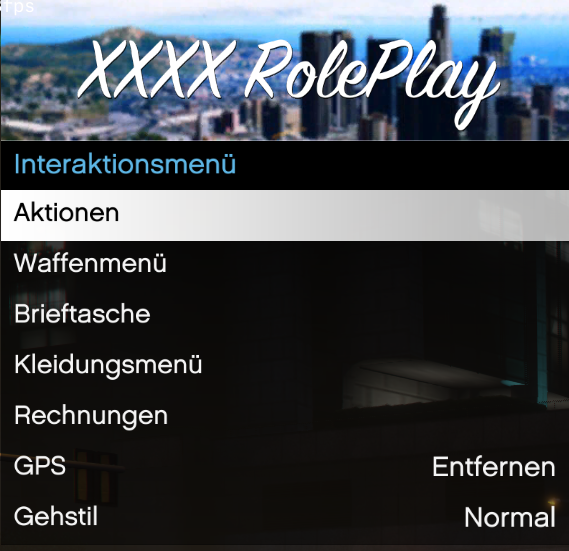
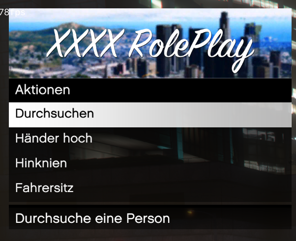
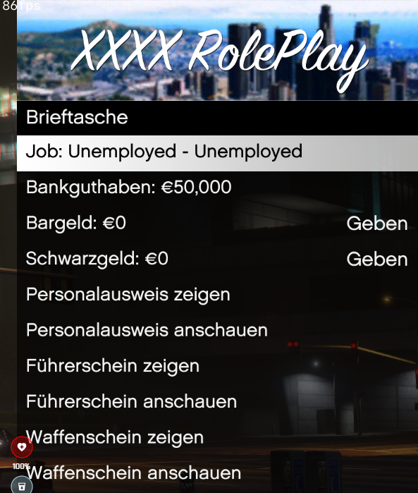
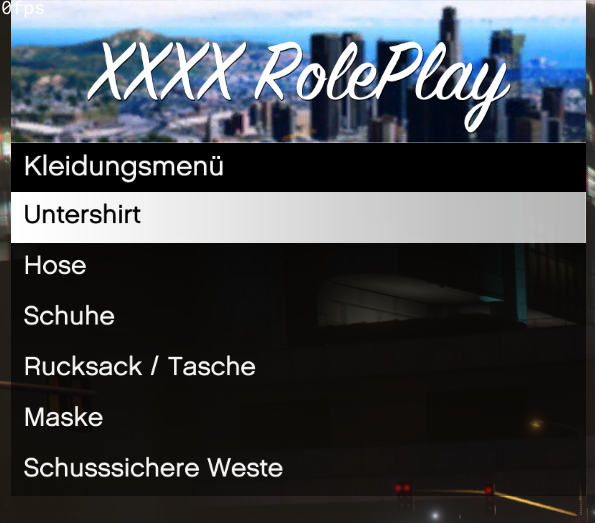

# Personalmenü für FiveM

Dieses Menü bietet Spielern in der FiveM-Modifikation für Grand Theft Auto V verschiedene Interaktionsmöglichkeiten und Zugriff auf persönliche Funktionen innerhalb des Spiels.

  
*Bild 1: Übersicht des Hauptmenüs*

## Funktionen

Das Menü ist in verschiedene Hauptbereiche unterteilt:

**Interaktionsmenü (Hauptmenü):**

* **Aktionen:**  
    
  *Bild 2: Aktionen-Menü*  
  Ermöglicht verschiedene Spieleraktionen wie:
    * Durchsuchen
    * Hände hoch
    * Hinknien
    * Fahrersitz (vermutlich um schnell in ein Fahrzeug zu gelangen)

* **Waffenmenü:**  
  Ermöglicht den Zugriff auf Waffen und zugehörige Optionen.

* **Brieftasche:**  
    
  *Bild 3: Brieftasche-Menü*  
  Zeigt Informationen zum Kontostand und Bargeld des Spielers an. Ermöglicht außerdem Aktionen wie:
    * Geben (von Bargeld und Schwarzgeld an andere Spieler)
    * Personalausweis zeigen/anschauen
    * Führerschein zeigen/anschauen
    * Waffenschein zeigen/anschauen

* **Kleidungsmenü:**  
    
  *Bild 4: Kleidungsmenü*  
  Bietet Optionen zur Anpassung des Erscheinungsbilds des Spielers durch Auswahl verschiedener Kleidungsstücke:
    * Unterhemd
    * Hose
    * Schuhe
    * Rucksack / Tasche
    * Maske
    * Schusssichere Weste

* **Rechnungen:**  
  Ermöglicht die Verwaltung von Rechnungen im Spiel.

* **GPS:**  
  Bietet Zugriff auf Navigationsfunktionen.

* **Gehstil:**  
  Ermöglicht die Änderung des Bewegungsstils des Spielercharakters.

* **Entfernen:**  
  (Im Kontext von "GPS" vermutlich eine Option, um ein Ziel zu entfernen)

* **Normal:**  
  (Im Kontext von "Gehstil" vermutlich die Standardeinstellung)

## Verwendung

Dieses Menü wird wahrscheinlich im Spiel durch eine bestimmte Taste oder Tastenkombination aufgerufen. Die Navigation innerhalb des Menüs erfolgt üblicherweise mit den Pfeiltasten oder der Maus. Die Auswahl einer Option wird in der Regel durch Drücken der Eingabetaste oder Klicken mit der Maus bestätigt.

## Hinweise

Dieses Menü ist spezifisch für den FiveM-Multiplayer-Modus von Grand Theft Auto V und wird in dieser Form nicht im Standardspiel vorhanden sein. Die genauen Funktionen und die Bedienung können je nach Serverkonfiguration und verwendeten Skripten variieren.
